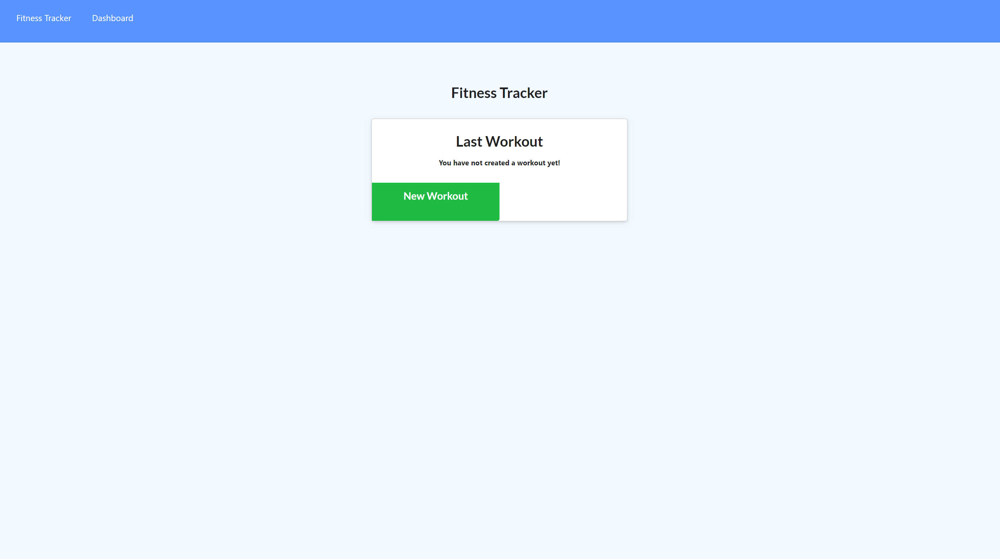

# Fitness Tracker

## Description
For this assignment, I have create a workout tracker. I was already been provided with the front end code but this assignment required me to create Mongo database with a Mongoose schema and handle routes with Express.

## Technologies Used

- JS
- Node
- Express Server
- Express Router
- Mongoose

## Install
From the command line:
- npm i
- npm run seed
- npm start

## Screenshot

## Links
- [GitHub](https://github.com/j-okeefe)
- [Deployment](https://fitness-tracker-321.herokuapp.com/)
- [Email](mailto:jbo88@att.net)
